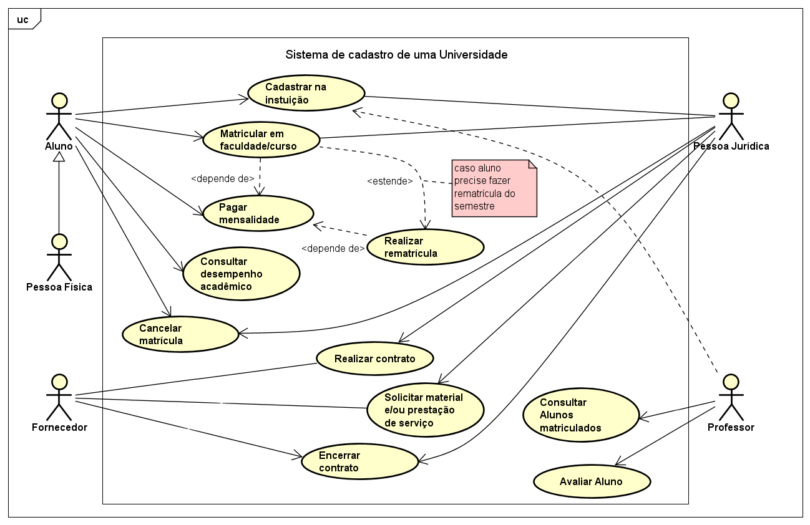
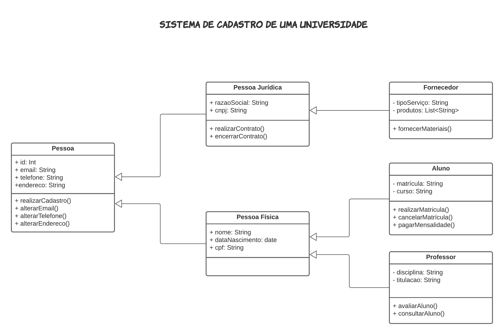
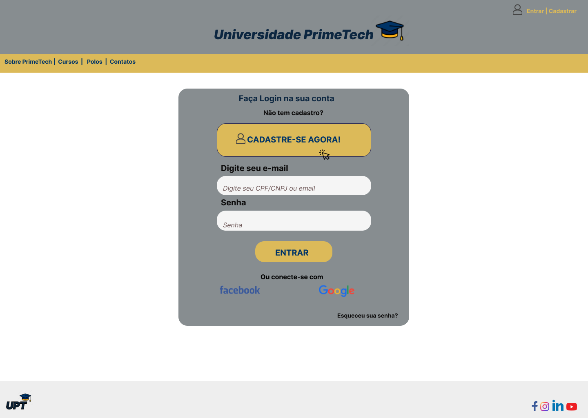
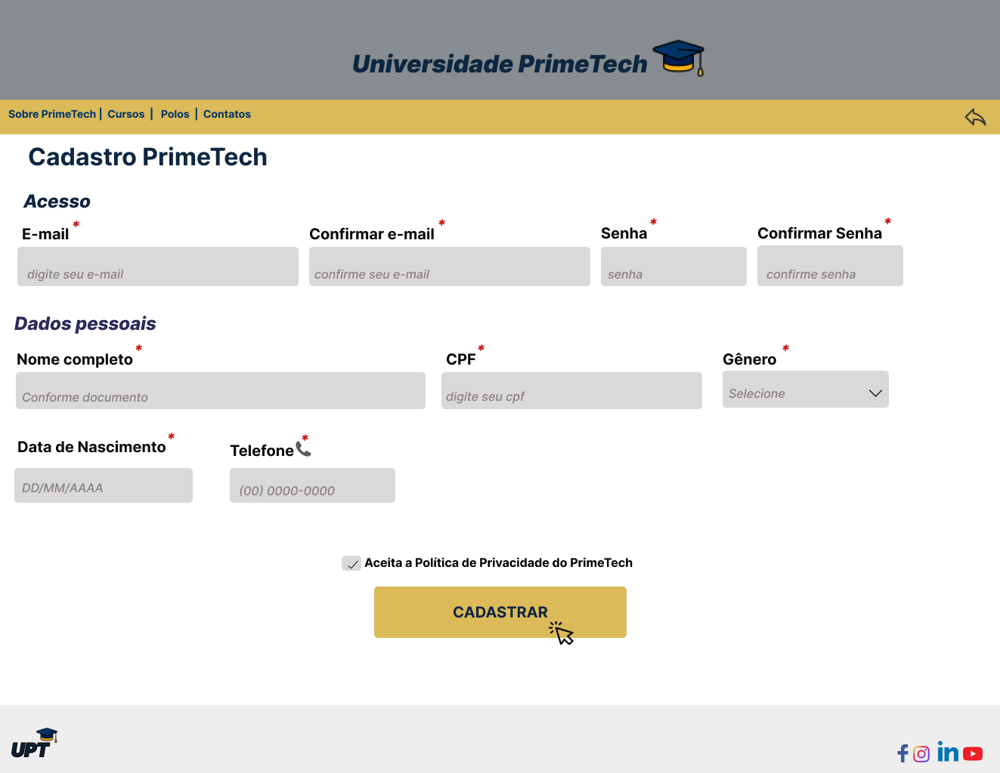
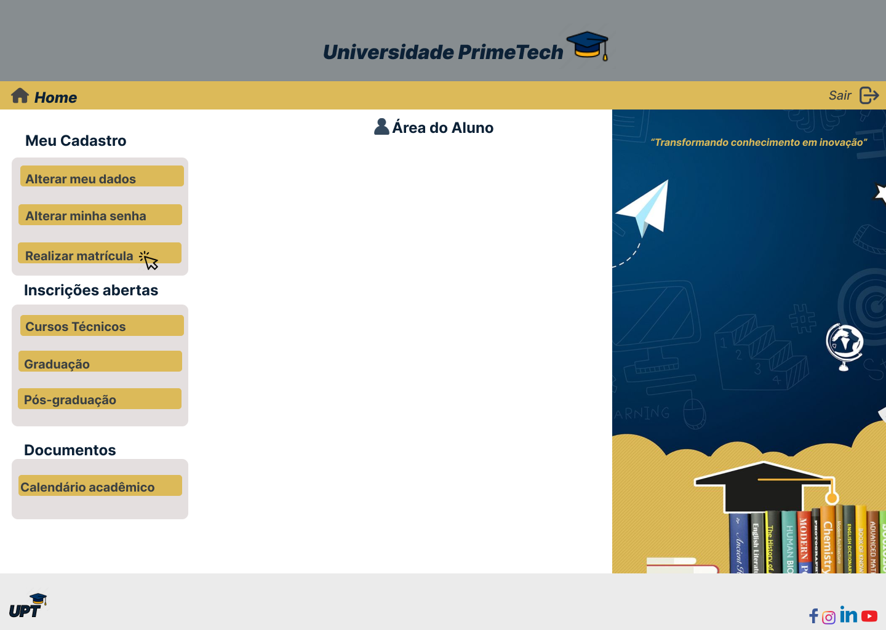
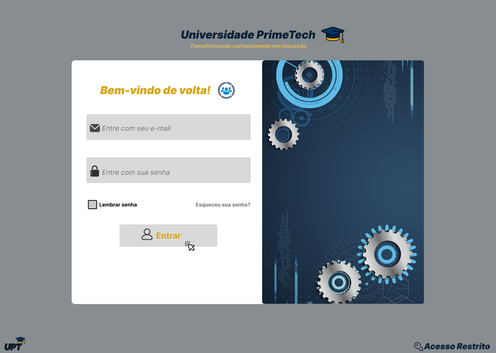
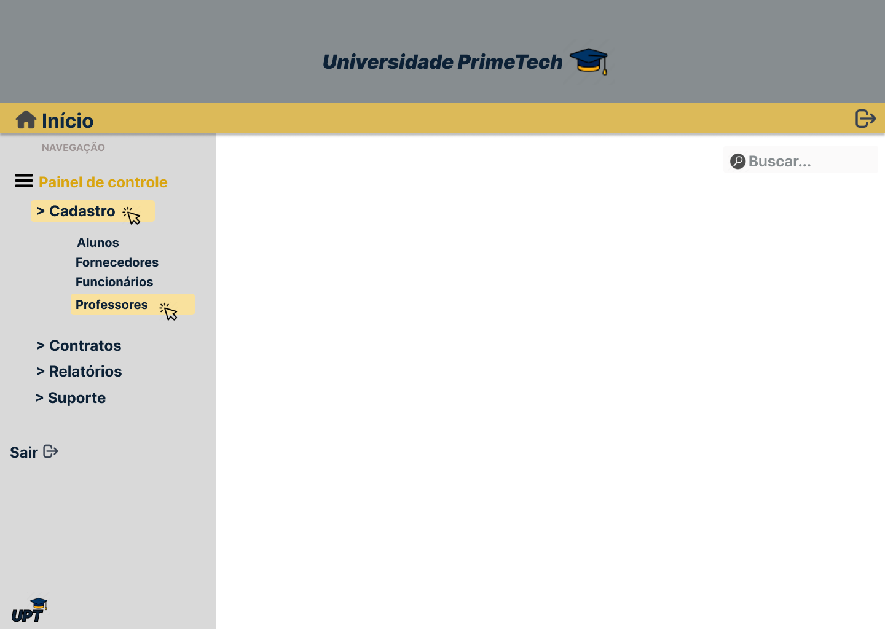
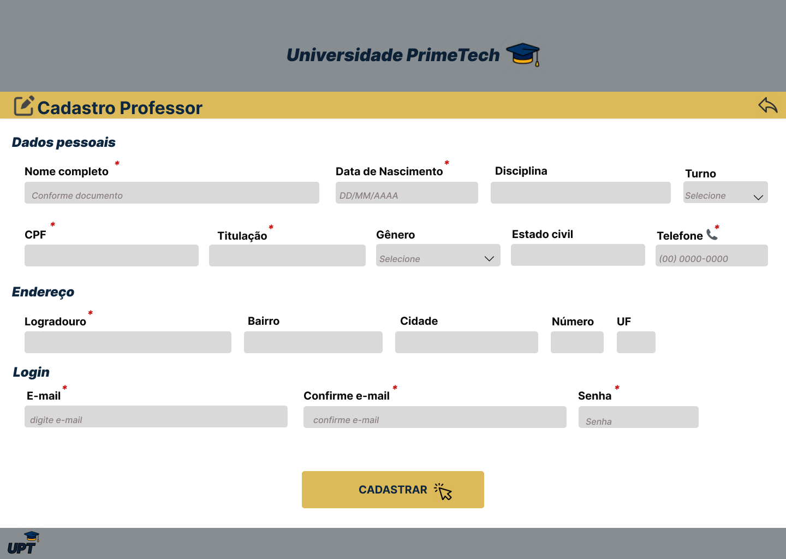
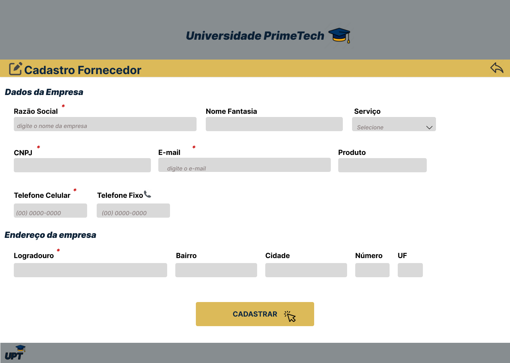

# PROJETO INTEGRADOR III: DESENVOLVIMENTO DE SISTEMAS ORIENTADO À OBJETOS

## Sistema de Cadastro de um Centro Universitário
 

## Integrantes do Grupo
- Andreza Azevedo Gomes de Freitas
- Lucas Vieira Rocha
 

### Resumo
Na primeira fase deste trabalho, apresentamos uma abordagem minuciosa da modelagem de um sistema de gestão de dados em um centro universitário, utilizando a Linguagem de Modelagem Unificada (UML). O foco foi na elaboração de um Diagrama de Casos de Uso que evidencia as principais interações entre os usuários e o sistema, seguido pela descrição dos cenários associados a cada caso de uso. Adicionalmente, introduzimos um Diagrama de Classes que representa a estrutura estática do sistema, identificando as classes principais e seus relacionamentos.

Nesta segunda etapa do Projeto Integrador, elaboramos protótipos das interfaces de cadastro de uma universidade fictícia denominada PrimeTech, utilizando a ferramenta Figma. Estes protótipos têm como objetivo demonstrar de forma prática a visualização das interfaces que serão empregadas pelos usuários no sistema final.

 

## Casos de Uso

 

## Diagrama de Classes

 

# Telas 
## Aluno
- **Login do Aluno:** Apresenta campos para inserção de email e senha, permitindo acesso à Área do Aluno. Também inclui um botão de 'CADASTRE-SE AGORA' para novos usuários que ainda não possuem cadastro na universidade.
 

 

- **Cadastro-Aluno:** Solicita e valida os dados essenciais para o cadastro do aluno no sistema.

 
 
 

- **Área-Aluno:** Acesso a documentos, cursos e matrícula.

 

## Gestor
- **Login-Gestor:** Requer email e senha para autenticação, garantindo acesso restrito exclusivamente aos gestores do sistema.

 

- **Painel-Controle-Gestão:** Permite acesso aos dados cadastrais de alunos, professores, funcionários e fornecedores. Além de fornecer informações sobre contratos, relatórios e contato direto com o suporte.

 
 
 

## Professor
- **Cadastro-Professor:** Solicita e valida os dados essenciais para o registro do professor no sistema.

 

## Fornecedor
- **Cadastro-Fornecedor:** Solicita e valida os dados essenciais para o registro do fornecedor no sistema.

 

> [!NOTE]
> Documentação em andamento...

